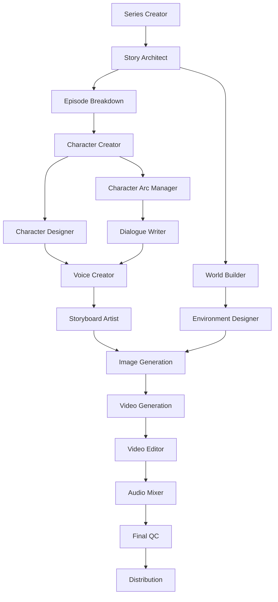
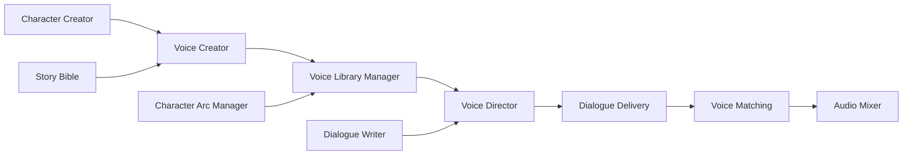
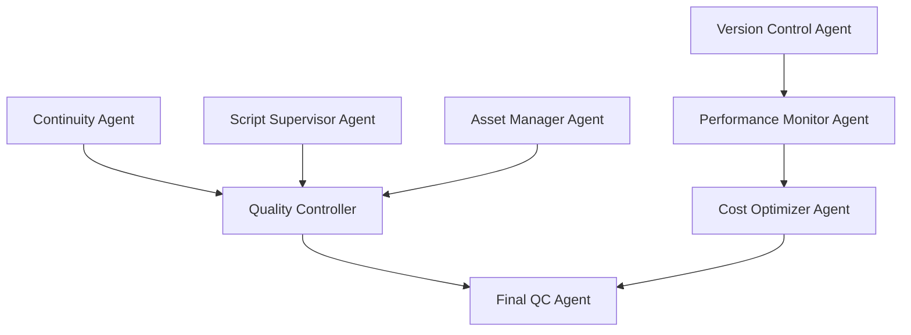

# Movie Generation Platform - AI Agent System

**Last Verified**: January 28, 2025
**Status**: Comprehensive planning complete | Implementation in Phase 3 (Q2 2025)

## 🤖 Complete AI Movie Production Agent System

The platform features **50+ specialized AI agents** working together to produce complete movies from concept to distribution. Each agent is a specialized LLM with specific prompts, tools, and workflows designed for particular aspects of movie production.

## 🎭 Agent Roster by Department

### **Pre-Production Agents (14 agents)**

#### **Story Development (6 agents)**
| Agent | Role | MCP Service | Specialization |
|-------|------|-------------|----------------|
| **Series Creator** | Initial concept, genre, tone, target audience | Story MCP | Creative vision and foundation |
| **Story Architect** | Overarching narrative arc across episodes | Story MCP | Narrative structure and continuity |
| **Episode Breakdown** | Individual episode structure, beats, pacing | Story MCP | Scene-level planning |
| **Story Bible** | Canonical facts, character consistency, timeline | Story MCP | Consistency and canon management |
| **Dialogue Writer** | Character voice consistency, natural conversation | Story MCP | Character-specific dialogue |
| **World Builder** | Universe rules, geography, culture, history | Story MCP | Setting and environment creation |

#### **Character & Casting (5 agents)**
| Agent | Role | MCP Service | Specialization |
|-------|------|-------------|----------------|
| **Character Creator** | Personalities, backstories, character arcs | Character MCP | Character foundation |
| **Character Designer** | Visual appearance, clothing, distinctive features | Character MCP | Visual character design |
| **Voice Creator** | Unique voice profiles, emotional range, speech patterns | Character MCP | Voice synthesis and consistency |
| **Casting Director** | Matches character types to archetypes | Character MCP | Character-actor matching |
| **Character Arc Manager** | Tracks development across episodes | Character MCP | Long-term character evolution |

#### **Visual Design (7 agents)**
| Agent | Role | MCP Service | Specialization |
|-------|------|-------------|----------------|
| **Concept Artist** | Visual mood boards, style guides, artistic direction | Visual MCP | Overall visual style |
| **Environment Designer** | Locations, sets, architectural elements | Visual MCP | Set and location design |
| **Costume Designer** | Period-accurate clothing, character wardrobe | Visual MCP | Character costume design |
| **Props Master** | Objects, vehicles, weapons, set pieces | Visual MCP | Physical prop design |
| **Makeup/SFX Designer** | Special effects makeup, aging, creatures | Visual MCP | Character transformation |
| **Storyboard Artist** | Script to visual sequence conversion | Visual MCP | Scene visualization |
| **Shot Designer** | Camera angles, movements, compositions | Visual MCP | Cinematographic planning |

### **Production Planning Agents (5 agents)**

#### **Scene Planning**
| Agent | Role | Specialization |
|-------|------|----------------|
| **Scene Director** | Blocking, character positioning, choreography | Scene coordination |
| **Cinematographer** | Lighting mood, camera techniques, visual style | Camera and lighting design |
| **Continuity** | Visual consistency between shots and scenes | Quality assurance |
| **Production Manager** | Task scheduling, dependencies, resources | Project coordination |
| **Quality Controller** | Content review for consistency and quality | Quality management |

### **Production Agents (11+ agents)**

#### **Content Generation (6 agents)**
| Agent | Role | Technology Integration |
|-------|------|----------------------|
| **Image Generation** | Concept art, character designs, environments | FAL.ai integration |
| **Video Generation** | 7-second video segments from storyboards | Advanced video AI |
| **Animation Director** | Character movements, facial expressions | Motion synthesis |
| **Camera Operator** | Virtual camera work execution | Cinematic AI |
| **Lighting Designer** | Mood lighting, atmospheric effects | Lighting AI |
| **VFX Supervisor** | Special effects coordination, digital environments | Effects coordination |

#### **Performance (6 agents)**
| Agent | Role | MCP Service | Specialization |
|-------|------|-------------|----------------|
| **Voice Director** | AI voice synthesis guidance and consistency | Audio MCP | Voice direction |
| **Voice Library Manager** | Voice model maintenance across episodes | Audio MCP | Voice asset management |
| **Voice Matching** | Ensures voice consistency across scenes | Audio MCP | Quality control |
| **Dialogue Delivery** | Pacing, emphasis, emotional subtext | Audio MCP | Performance nuance |
| **Motion Capture** | Realistic character movements and gestures | Character MCP | Physical performance |
| **Facial Animation** | Believable expressions and lip sync | Character MCP | Facial performance |

### **Post-Production Agents (12+ agents)**

#### **Editing & Assembly (4 agents)**
| Agent | Role | Specialization |
|-------|------|----------------|
| **Video Editor** | Scene cutting, pacing, rhythm management | Editorial control |
| **Compositor** | Visual element combination, green screen integration | Visual compositing |
| **Color Grader** | Visual mood, lighting correction, film look | Color correction |
| **VFX Supervisor** | Special effects coordination, digital environments | Effects management |

#### **Audio Production (4 agents)**
| Agent | Role | MCP Service | Specialization |
|-------|------|-------------|----------------|
| **Sound Designer** | Ambient sounds, sound effects library | Audio MCP | Sound creation |
| **Music Composer** | Episode scores, character themes, emotional cues | Audio MCP | Musical composition |
| **Audio Mixer** | Dialogue, music, effects balance | Audio MCP | Audio engineering |
| **Foley Artist** | Realistic everyday sounds | Audio MCP | Sound effects |

#### **Quality & Delivery (4 agents)**
| Agent | Role | Specialization |
|-------|------|----------------|
| **Final QC** | Technical and creative quality review | Quality assurance |
| **Subtitle/Caption** | Accurate subtitles, accessibility features | Accessibility |
| **Distribution** | Platform formatting, resolution optimization | Delivery optimization |
| **Marketing Asset** | Trailers, promotional clips, social media | Marketing content |

### **Coordination Agents (10+ agents)**

#### **Cross-Department (4 agents)**
| Agent | Role | Specialization |
|-------|------|----------------|
| **Script Supervisor** | Scene completion, script changes, continuity | Production oversight |
| **Location Scout** | Real-world reference footage sourcing | Reference gathering |
| **Research** | Period accuracy, cultural authenticity, fact-checking | Accuracy verification |
| **Legal Compliance** | Platform guidelines, rating requirements | Compliance management |

#### **Technical Infrastructure (4+ agents)**
| Agent | Role | MCP Service | Specialization |
|-------|------|-------------|----------------|
| **Render Farm Coordinator** | GPU resource management | Asset MCP | Resource optimization |
| **Version Control** | Asset versions, backup systems | Asset MCP | Asset management |
| **Performance Monitor** | Generation speeds, bottleneck identification | Asset MCP | Performance tracking |
| **Cost Optimizer** | API usage monitoring, efficiency suggestions | Asset MCP | Economic optimization |

## 🔄 Agent Interaction Workflows

### **Primary Production Pipeline**


### **Voice Pipeline Workflow**


### **Quality Control Workflow**


## 🏗️ Technical Implementation

### **Agent Architecture**
Each agent is implemented as:
- **Specialized LLM**: Custom prompts and system instructions
- **MCP Tools**: Specific tools for domain operations
- **Workflow Integration**: LangGraph-based coordination
- **State Management**: Persistent memory and context
- **Quality Gates**: Input/output validation and consistency checks

### **MCP Service Distribution**
| **Service** | **Port** | **Agents** | **Specialization** |
|-------------|----------|------------|-------------------|
| **Story MCP** | 8010 | 6 agents | Narrative and world building |
| **Character MCP** | 8011 | 5 agents | Character creation and management |
| **Visual MCP** | 8012 | 7 agents | Visual design and storyboarding |
| **Audio MCP** | 8013 | 6 agents | Sound and music production |
| **Asset MCP** | 8014 | 4 agents | Asset management and optimization |


### MCP Service Domains (Local / Dev / Prod)

- Story MCP (port 8010)
  - Local: localhost:8010
  - Dev: story.ngrok.pro
  - Prod: story.ft.tc

- Character MCP (port 8011)
  - Local: localhost:8011
  - Dev: character.ngrok.pro
  - Prod: character.ft.tc

- Visual MCP (port 8012)
  - Local: localhost:8012
  - Dev: visual.ngrok.pro
  - Prod: visual.ft.tc

- Audio MCP (port 8013)
  - Local: localhost:8013
  - Dev: audio.ngrok-free.dev
  - Prod: story-architect.ft.tc

- Asset MCP (port 8014)
  - Local: localhost:8014
  - Dev: asset.ngrok.pro
  - Prod: asset.ft.tc

- Story Bible MCP (port 8015)
  - Local: localhost:8015
  - Dev: story-bible.ngrok.pro
  - Prod: story-bible.ft.tc

### **Coordination Patterns**

#### **Sequential Dependencies**
```
Story Bible → Continuity → Quality Controller → Final QC
Voice Creator → Voice Library Manager → Voice Director → Dialogue Delivery → Voice Matching
Storyboard Artist → Image Generation → Video Generation → Video Editor → Compositor
```

#### **Parallel Processing Groups**
- **Character Development**: Character Designer + Voice Creator + Character Arc Manager
- **Visual Design**: Concept Artist + Environment Designer + Costume Designer + Props Master
- **Content Generation**: Image Generation + Video Generation + Animation Director
- **Audio Production**: Voice Director + Sound Designer + Music Composer + Foley Artist

#### **Critical Path Agents** (Must complete before others can proceed)
1. **Series Creator** → All other agents depend on initial concept
2. **Story Architect** → Episode and character development depends on overall arc
3. **Character Creator** → Voice, visual, and casting agents need character profiles
4. **Episode Breakdown** → Scene planning and production agents need episode structure

## 📊 Resource Allocation

### **Agent Instances**
- **Single Instance**: Story Bible, Series Creator, Production Manager
- **Multiple Instances**: Video Generation (per episode), Character Designer (per character)
- **Load Balanced**: Image Generation, Voice Generation, Quality Control

### **Resource Requirements**
- **CPU Heavy**: Text-based agents (Story, Dialogue, Script)
- **GPU Heavy**: Image Generation, Video Generation, Animation
- **Memory Heavy**: Voice Library Manager, Asset Manager, Version Control

### **Coordination Complexity**
- **Low**: Individual creative agents working in isolation
- **Medium**: Cross-department coordination (Visual + Audio)
- **High**: Quality control across all departments, final assembly

## 🎯 Implementation Status

### **Phase 3 Planning (Q2 2025)**
- **Domain MCP Services**: Story, Character, Visual, Audio, Asset
- **Agent Implementation**: 50+ specialized agents with custom prompts
- **Workflow Coordination**: LangGraph-based multi-agent orchestration
- **Quality Control**: Automated consistency and continuity checking

### **Current Status**
- **Architecture**: ✅ Complete planning and workflow design
- **MCP Services**: 📁 Scaffolded (folder structure and documentation)
- **Agent Implementation**: ❌ Not started (awaiting Phase 3)
- **Coordination**: ❌ Not started (awaiting LangGraph integration)

### **Dependencies**
- **Phase 2 Completion**: MCP integration and frontend completion
- **LangGraph Enhancement**: Multi-agent workflow capabilities
- **Prompt Management System**: Template-based AI prompt system
- **Resource Management**: GPU coordination and cost optimization

---

This comprehensive AI agent system represents the most ambitious AI movie production platform ever conceived, with specialized agents covering every aspect of professional movie creation from initial concept to final distribution.

**Related Documentation**:
- `docs/thoughts/movie-platform-idea.md` - Complete agent specifications and workflows
- `DEVELOPMENT_STATUS.md` - Current implementation progress and Phase 3 planning
- `ARCHITECTURE.md` - Technical architecture and MCP service integration
- `docs/thoughts/prompt-management.md` - AI prompt system for agent coordination