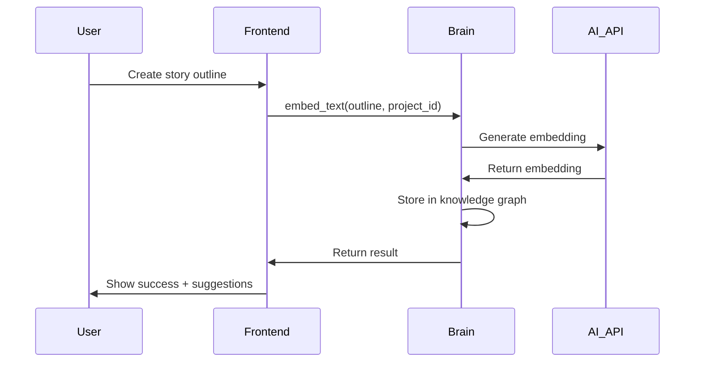
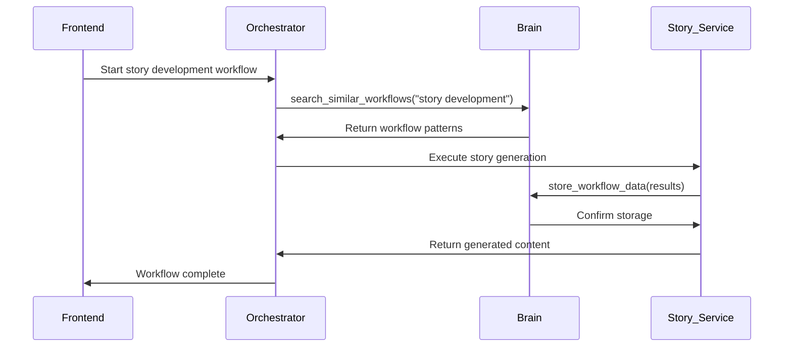
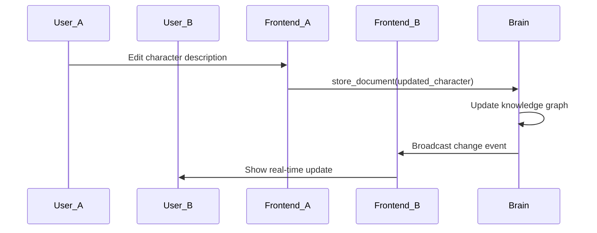
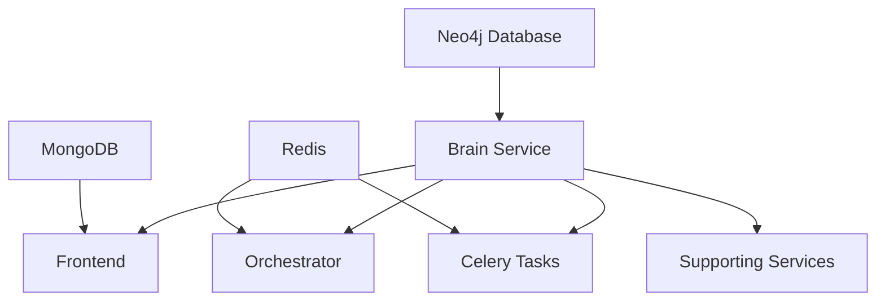

# Movie Generation Platform - Technical Architecture

**Last Verified**: January 28, 2025

## 🧠 Core Architecture Pattern: Centralized Brain Service

The platform follows a **centralized intelligence model** where all AI/ML operations flow through a single "brain" service, ensuring consistency, reliability, and easier maintenance.

```mermaid
graph TB
    subgraph "External Services"
        Jina[Jina v4 Embeddings API]
        Neo4j[Neo4j Graph Database]
        OpenRouter[OpenRouter LLM API]
        FAL[FAL.ai Media Generation]
        ElevenLabs[ElevenLabs Voice]
    end
    
    subgraph "Core Brain Service (Port 8002)"
        Brain[MCP Brain Service]
        Brain --> Jina
        Brain --> Neo4j
        Brain --> OpenRouter
        Brain --> FAL
        Brain --> ElevenLabs
    end
    
    subgraph "Application Services"
        Frontend[Auto-Movie Frontend<br/>Next.js (Port 3010)]
        Orchestrator[LangGraph Orchestrator<br/>Python (Port 8003)]
        Celery[Celery Task Service<br/>Python (Port 8001)]
        
        Frontend -.->|MCP WebSocket| Brain
        Orchestrator -.->|MCP WebSocket| Brain
        Celery -.->|MCP WebSocket| Brain
    end
    
    subgraph "Supporting Services"
        Analytics[Analytics Service]
        Export[Export Service]
        Story[Story Service]
        Character[Character Service]
        Visual[Visual Design Service]
        Audio[Audio Service]
        Video[Video Processing Service]
        Media[Media Transcoding Service]
        Asset3D[3D Asset Service]
        Webhook[Webhook Dispatcher]
        
        Analytics -.->|MCP WebSocket| Brain
        Export -.->|MCP WebSocket| Brain
        Story -.->|MCP WebSocket| Brain
        Character -.->|MCP WebSocket| Brain
        Visual -.->|MCP WebSocket| Brain
        Audio -.->|MCP WebSocket| Brain
        Video -.->|MCP WebSocket| Brain
        Media -.->|MCP WebSocket| Brain
        Asset3D -.->|MCP WebSocket| Brain
        Webhook -.->|MCP WebSocket| Brain
    end
    
    Users[Users] --> Frontend
```

## 🔧 Key Architectural Principles

### 1. **Single Point of AI Integration**
- **Only the MCP Brain Service** connects directly to external AI APIs
- All other services use MCP (Model Context Protocol) WebSocket connections
- Eliminates API key sprawl and ensures consistent AI behavior
- Centralized rate limiting, error handling, and fallback logic

### 2. **MCP-First Communication**
- All inter-service communication uses MCP WebSocket protocol
- Standardized tool calling interface across all services  
- Real-time bidirectional communication for collaborative features
- Built-in authentication and session management

### 3. **Microservices with Shared Intelligence**
- Services remain independent and deployable separately
- Shared AI/ML context through centralized brain service
- Each service focuses on domain-specific functionality
- Horizontal scaling while maintaining consistency

### 4. **Project-Scoped Operations**
- All data operations include `project_id` for multi-tenancy
- Logical isolation of user projects and data
- Consistent security and access control patterns
- Easy data export and project migration

## 🏗️ Service Breakdown

### Core Services (Essential)

#### MCP Brain Service (Port 8002)
**Role**: Central AI/ML hub and knowledge repository

**Responsibilities**:
- Text embedding generation (Jina v4)
- Semantic similarity search  
- Knowledge graph management (Neo4j)
- LLM request routing and fallbacks
- Media analysis and metadata extraction
- Cross-project knowledge sharing

**Technology Stack**:
- **Language**: Python 3.11+
- **Framework**: FastAPI with WebSocket support
- **Database**: Neo4j (graph) + SQLite (metadata)
- **AI APIs**: Jina v4, OpenRouter, FAL.ai, ElevenLabs
- **Communication**: MCP WebSocket server

**Key MCP Tools** (20+ available):
```python
# Core embedding tools
embed_text(text: str, project_id: str) -> EmbeddingResult
batch_embed_texts(texts: List[str], project_id: str) -> List[EmbeddingResult]

# Semantic search tools  
search_by_embedding(embedding: List[float], project_id: str, limit: int) -> SearchResults
batch_similarity_search(queries: List[str], project_id: str) -> List[SearchResults]

# Knowledge graph tools
create_relationship(from_node: str, to_node: str, relationship: str, project_id: str)
query_graph(cypher_query: str, project_id: str) -> QueryResults
get_node_neighbors(node_id: str, project_id: str) -> List[GraphNode]

# Document management
store_document(content: str, metadata: dict, project_id: str) -> Document
bulk_store_documents(documents: List[dict], project_id: str) -> List[Document]

# Workflow integration
store_workflow_data(workflow_id: str, data: dict, project_id: str)
search_similar_workflows(description: str, project_id: str) -> List[WorkflowData]
```

#### Auto-Movie Frontend (Port 3010)
**Role**: User interface and project management

**Responsibilities**:
- Project creation and management interface
- Real-time collaborative editing
- File upload and media management
- Chat interface for AI assistance
- Progress tracking and visualization

**Technology Stack**:
- **Language**: TypeScript
- **Framework**: Next.js 15.4+ (App Router)
- **UI**: React 19.1+ with Tailwind CSS + ShadCN/UI
- **Database**: PayloadCMS 3.56+ with MongoDB
- **Communication**: MCP WebSocket client + REST APIs

#### LangGraph Orchestrator (Port 8003)
**Role**: Workflow orchestration and multi-agent coordination

**Responsibilities**:
- Complex workflow execution (story development, script generation)
- Multi-agent coordination and task delegation
- Context management across workflow steps
- Integration with brain service for persistent knowledge

**Technology Stack**:
- **Language**: Python 3.11+
- **Framework**: LangGraph for workflow definition
- **Communication**: MCP WebSocket client
- **State Management**: Redis for workflow state

#### Celery Task Service (Port 8001)  
**Role**: Background task processing and heavy computation

**Responsibilities**:
- Asynchronous task execution (video processing, batch operations)
- GPU-intensive operations (image/video generation)
- Scheduled tasks and background jobs
- Task progress tracking and result storage

**Technology Stack**:
- **Language**: Python 3.11+
- **Framework**: Celery with Redis broker
- **Communication**: MCP WebSocket client
- **Storage**: File system + cloud storage integration

### Supporting Services (Domain-Specific)

#### Content Services
- **Story Service**: Narrative development and script management
- **Character Service**: Character creation and consistency tracking  
- **Visual Design Service**: Storyboarding and concept generation
- **Audio Service**: Music and sound effect processing
- **Video Processing Service**: Video editing and compilation
- **3D Asset Service**: 3D model generation and management

#### Infrastructure Services
- **Analytics Service**: Usage tracking and performance monitoring
- **Export Service**: Multi-format project exports
- **Media Transcoding Service**: File format conversion and optimization
- **Webhook Dispatcher Service**: External integration and notifications

## 🔄 Data Flow Patterns

### 1. **User Request Flow**


### 2. **Multi-Service Collaboration Flow**


### 3. **Real-time Collaboration Flow**


## 🛡️ Security Architecture

### Authentication & Authorization
- **JWT-based authentication** across all services
- **Role-based access control**: Producer, Director, Writer, Viewer roles
- **Project-scoped permissions**: Users can only access their authorized projects
- **Service-to-service authentication**: MCP WebSocket connections use service tokens

### Data Protection
- **Encryption in transit**: TLS for all external connections, WSS for MCP
- **Encryption at rest**: Database encryption for sensitive project data
- **API key security**: Centralized in brain service only, never exposed to clients
- **Input validation**: Comprehensive validation at service boundaries

### Privacy Controls
- **Project isolation**: Complete data separation between different user projects
- **Optional local processing**: Some AI operations can run locally if configured
- **Data retention policies**: Configurable project data retention and deletion
- **Audit logging**: All operations tracked for compliance and debugging

## ⚡ Performance Characteristics

### Latency Targets
- **Embedding generation**: < 100ms average
- **Similarity search**: < 50ms for 10,000+ documents
- **MCP WebSocket**: < 20ms round-trip time
- **Knowledge graph queries**: < 200ms for complex traversals

### Throughput Capabilities
- **Concurrent MCP connections**: 100+ per brain service instance
- **Batch processing**: 80% efficiency improvement vs individual requests
- **Document storage**: 1,000+ documents/second sustained
- **Real-time updates**: Sub-second propagation across all connected clients

### Scalability Design
- **Horizontal scaling**: All services designed for multi-instance deployment
- **Database sharding**: Neo4j clustering for knowledge graph scaling
- **Load balancing**: Built-in support for service load balancing
- **Caching layers**: Redis caching for frequently accessed data

## 🔌 Integration Points

### External API Dependencies
- **Jina v4**: Text embedding generation (critical path)
- **Neo4j**: Knowledge graph storage (critical path)
- **OpenRouter**: LLM API routing with fallback support
- **FAL.ai**: Image/video generation (async processing)
- **ElevenLabs**: Voice generation (async processing)

### Optional Integrations  
- **Cloud Storage**: AWS S3, Google Cloud Storage, Cloudflare R2
- **CDN**: Cloudflare for media distribution
- **Monitoring**: Prometheus + Grafana for observability
- **Authentication**: OAuth providers (Google, GitHub, etc.)

## 🐳 Deployment Architecture

### Container Strategy
```yaml
# Docker Compose service organization
services:
  neo4j:          # Database (must start first)
  brain-service:  # Core service (start second)
  orchestrator:   # Workflow service
  celery-worker:  # Background tasks
  frontend:       # User interface
  nginx:          # Load balancer/proxy
```

### Environment Tiers
- **Development**: Single-machine Docker Compose
- **Staging**: Kubernetes cluster with external database
- **Production**: Multi-region deployment with CDN and monitoring

### Service Dependencies


---

## 📚 Implementation Notes

### Current Status
- **Brain Service**: ✅ Fully implemented and tested
- **Frontend**: 🔄 Basic structure with PayloadCMS integration
- **Orchestrator**: 🔄 75% complete, needs MCP integration cleanup
- **Celery Service**: ❌ Needs MCP integration implementation  
- **Supporting Services**: ❌ Scaffolded but not implemented

### Development Priority
1. Complete MCP integration for orchestrator service
2. Implement TypeScript MCP client for frontend
3. Add MCP integration to celery service
4. Implement domain-specific services as needed

### Migration Path
Services are being incrementally migrated to the MCP pattern:
- **Phase 1**: Direct API calls → Centralized brain service ✅
- **Phase 2**: REST communication → MCP WebSocket communication 🔄
- **Phase 3**: Individual service databases → Shared knowledge graph 📋

---

**Related Documentation**:
- `PROJECT_OVERVIEW.md` - High-level project goals and vision
- `DEVELOPMENT_STATUS.md` - Current implementation progress  
- `API_REFERENCE.md` - Complete MCP tool and REST API reference
- `SETUP_GUIDE.md` - Local development environment setup